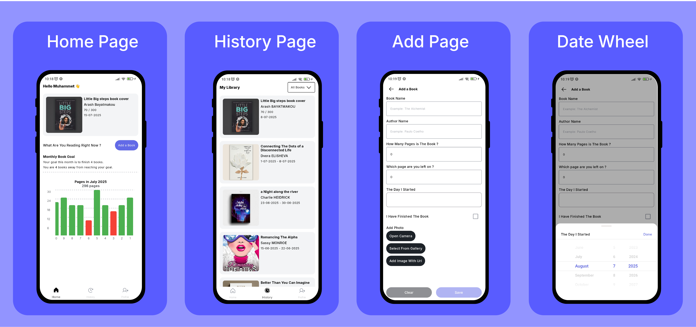
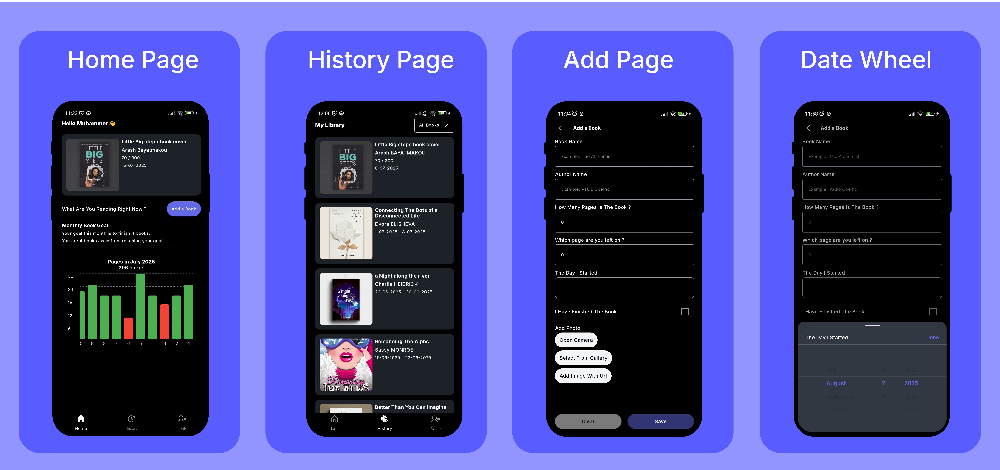

# LitLounge 📚

A beautiful and intuitive reading tracker app built with **Compose Multiplatform (CMP)** that helps
you monitor your daily reading progress, set goals, and maintain your reading habits across *
*Android** and **iOS** platforms.

## 📱 Screenshots




## ✨ Features

### 📖 Reading Tracking

- **Daily Page Tracking**: Log how many pages you read each day
- **Book Management**: Add books with detailed information including:
    - Book title and author name
    - Start and finish dates
    - Book cover photos
    - Reading status (Currently Reading, Finished)

### 📊 Progress Visualization

- **Daily Reading Charts**: Visual representation of your daily reading progress
- **Reading Statistics**: Comprehensive stats about your reading habits
- **Progress Tracking**: Monitor your journey towards your reading goals

### 🎯 Goal Setting

- **Daily Page Goals**: Set and track daily reading page targets
- **Monthly Book Goals**: Challenge yourself with monthly book completion targets
- **Achievement Tracking**: Stay motivated with goal completion insights

### 🔔 Smart Notifications

- **Daily Reading Reminders**: Gentle nudges to maintain your reading habit
- **Customizable Timing**: Set notification times that work for your schedule
- **Progress Updates**: Get notified about your reading milestones

### 📚 Library Management

- **Reading History**: Browse through all the books you've completed
- **Currently Reading**: Keep track of books you're actively reading
- **Book Updates**: Edit book information and reading progress
- **Delete Books**: Remove books from your library when needed

### 📸 Photo Management

- **Multiple Photo Sources**: Add book covers from various sources:
    - **Camera**: Take photos directly with your device camera
    - **Gallery**: Select existing photos from your device gallery
    - **URL Input**: Add book covers by entering image URLs from the internet
        - **Real-time URL Validation**: Instant verification of image URLs using Ktor
        - **Live Preview**: Valid URLs show image preview immediately
        - **User Feedback**: Invalid URLs trigger helpful error messages
- **Optimized Image Loading**: Powered by Coil for smooth and efficient image loading

### 🌙 User Experience

- **Dark Mode Support**: Full dark theme implementation for comfortable reading in any lighting
  condition
- **Multi Language Support**: Seamless translation into multiple languages. English(Default),
  Turkish
- **Adaptive Interface**: UI automatically adapts to your system theme preferences

## 🛠 Technology Stack

### Architecture

- **MVVM Pattern**: Clean separation of concerns with Model-View-ViewModel architecture
- **Kotlin Multiplatform**: Shared business logic between Android and iOS
- **Dependency Injection**: Koin for clean and testable code structure

### Platforms

- **Android**: Native Android implementation
- **iOS**: Native iOS implementation
- **Shared Code**: Common business logic and data models

### Tech Stack

| Layer                | Library                                                                 |
|----------------------|-------------------------------------------------------------------------|
| UI                   | Compose Multiplatform                                                   |
| Dependency Injection | [Koin](https://insert-koin.io/)                                         |
| Image Loading        | [Coil](https://coil-kt.github.io/coil/)                                 |
| Networking           | [Ktor Client](https://ktor.io/)                                         |
| Persistence          | [Room](https://developer.android.com/jetpack/androidx/releases/room)    |
| Pagination           | [Multiplatform Paging](https://github.com/cashapp/multiplatform-paging) |

---

## 🚀 Getting Started

### Prerequisites

- **Android Studio**: Arctic Fox or newer
- **Kotlin Multiplatform Plugin**: Latest version

### Installation

1. **Clone the repository**
   ```bash
   git clone https://github.com/MuhammetKonukcu/litlounge.git
   ```

2. **Open in Android Studio**
   ```bash
   # Open the project in Android Studio
   # Make sure Kotlin Multiplatform plugin is installed
   ```

3. **Build project**

## 📊 Core Features Implementation

### Reading Progress Tracking

- Daily page count logging with date stamps
- Automatic calculation of reading streaks
- Visual progress indicators and charts

### Goal Management System

- Flexible goal setting (daily/monthly)
- Progress monitoring with completion percentages
- Achievement notifications and celebrations

### Book Library System

- Comprehensive book metadata storage
- **Multi-source photo management**: Camera, gallery, and URL support
- **Smart URL validation**: Real-time image URL verification with Ktor
- **Optimized image handling**: Coil-powered image loading with caching
- Reading status management (TBR, Reading, Finished)

### Notification System

- Cross-platform notification scheduling
- Customizable reminder settings
- Reading milestone notifications

## 🔮 Roadmap

### Upcoming Features

- [ ] **Cloud Synchronization**: Sync data across devices
- [ ] **Social Features**: Share reading progress with friends
- [ ] **Book Recommendations**: AI-powered book suggestions
- [ ] **Reading Insights**: Advanced analytics and insights
- [ ] **Export Data**: Export reading data to various formats
- [ ] **Reading Timer**: Track time spent reading
- [ ] **Book Reviews**: Rate and review completed books

## 📄 License

This project is licensed under the MIT License.

**Happy Reading! 📖✨**

*Made with ❤️ using Compose Multiplatform*